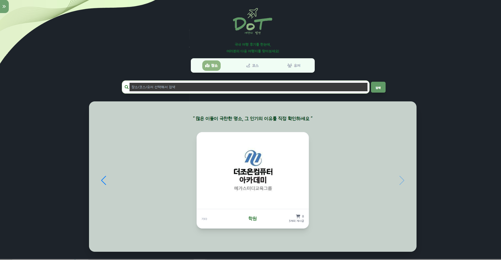
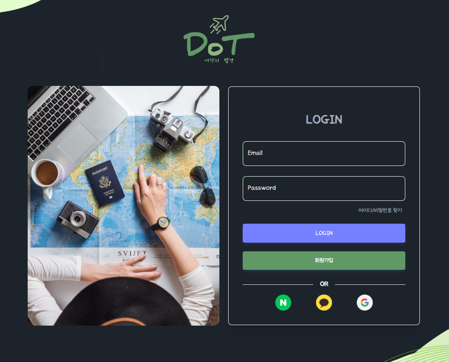
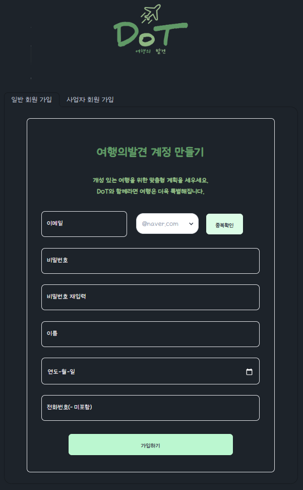
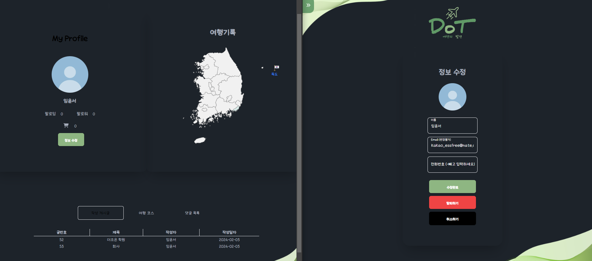
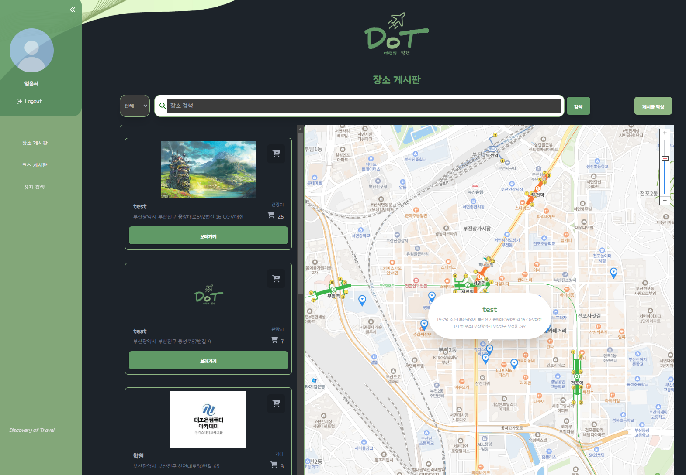
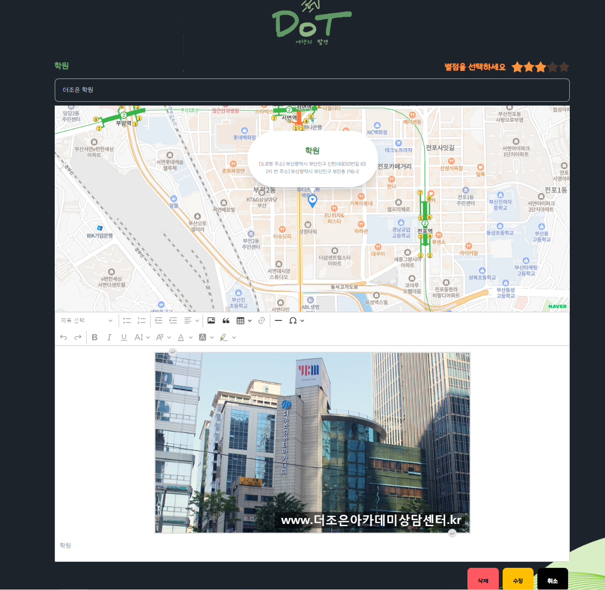
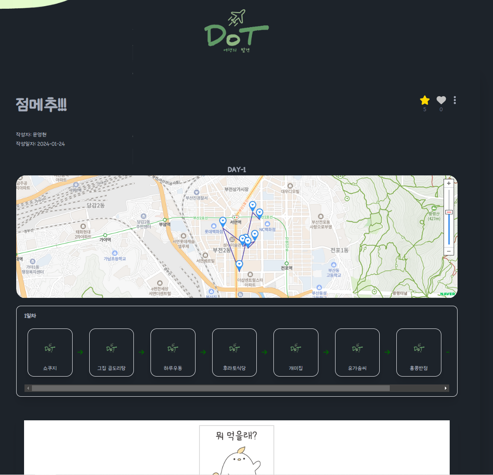

**여행플래너 및 여행 정보 공유 사이트 DoT (Discovery of Travel)**
##
DoT Client 는 React 및 TypeScript를 사용하여 제작하였습니다.  

### 메인화면
 
- 키워드 검색
- 검색 필터 (장소, 코스, 사용자명)
- 추천순 게시글 노출 (DB 쿼리)
- 장소추천 게시글 및 유저 여행 코스 게시물(NaverMap API)
- Slider 를 사용하여 다양한 게시글 노출
- (로그인 상태)팔로워 게시글 노출
 - 광고노출
## 
### 로그인

   - Spring Security 로그인
   - (Naver,google,kakako) OAuth 로그인
## 
### 회원가입

- 인증 이메일 발송(JavaMailSender)
- 정규식을 활용한 이메일 및 휴대폰 번호 검사
- 사업자 회원가입 (국세청 사업자 인증 API)

##
### 마이페이지

- 회원정보 열람 및 수정
- 프로필 이미지 등록
- 팔로잉 팔로워 (목록)표시
- 장바구니 및 좋아요 한 게시글 목록
- 작성한 댓글 목록
- 방문장소 표시 지도

##
### 장소 게시판

- 장소별 게시글 열람
- 게시글 좋아요
- 게시글 장바구니 담기 
- 댓글 및 대댓글 작성
- 댓글 신고 기능

##
### 게시글 작성

- 지도 API 에서 장소 선택
- CKEditor 를 사용한 게시글 작성 및 사진 첨부 기능
- 장소 별점 주기 기능

##
### 코스 게시글 작성

- 지도에 코스 화살표 표시
- 일차별 코스 정리
- 설명 게시글 작성 및 사진 첨부