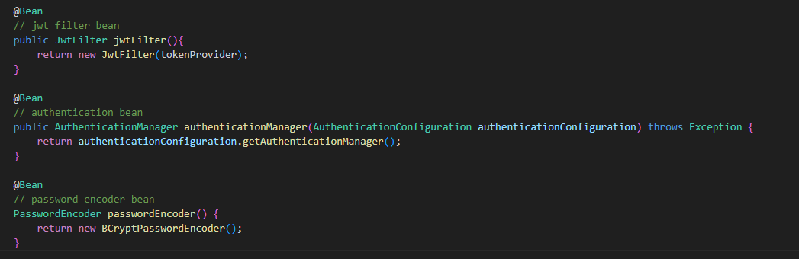
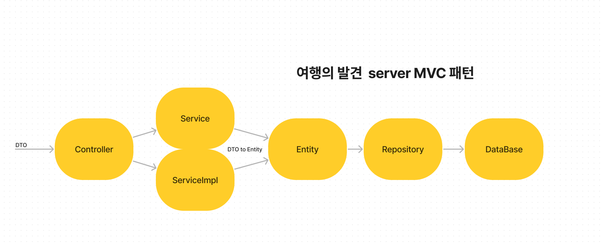

**여행플래너 및 여행 정보 공유 사이트 DoT (Discovery of Travel)**
##

DoT Server 는 SpringBoot, Java 및 IntelliJ IDEA 를 사용하여 제작 하였습니다.
Spring DTO 패턴을 사용하여 entity 와 client 간의 
컨트롤러는 클라이언트와의 분리를 위해 RESTController 를 사용하였습니다. 

Spring Security 를 사용하여 웹 보안을 구성하였습니다.
- 로그인시 JWT 토큰 발행 및 princiapal을 통한 회원정보 전달하여 validate 작업 진행

## Security Config

- 로그인, 회원가입 및 게시판 조회 등은 permitAll 설정을 통해 로그인 없이 조회 가능하게 설정하였습니다. 그 외에는 회원 신고 관련 안건을 처리하는 admin 계정, 이를 제외한 부분은 로그인 후 JWT를 발급받아야 조회 가능하게 설정하였습니다.

- jwt filter를 사용해 HTTP 요청에서 JWT 추출 및 토큰 검증
- AuthenticationManager 사용
- PasswordEncoder 를 통한 비밀번호 암호화 저장

- loadUserByUsername 을 overriding 하여 인증이 필요한 요청시 사용자 인증 및 권한 관리

- jwt payload에 사용자 정보 저장 (email, mno, Role)
- security context holder 의 Principal 에서 email , mno 를 추출하여 사용자 정보 비교를 수행 (ex: 댓글 삭제 요청시 작성자와 요청자의 mno 비교)

## MVC pattern

- 데이터 베이스와 비지니스 로직의 분리 및 코드의 묘듈화를 위해 MVC 패턴을 사용 하였습니다.
- 요청이 들어오면 controller 에서 알맞는 비지니스 로직을 가진 service 를 호출
- 필요한 경우 service 는 DTO를 Entity로 바꿔 repository를 통해 DB 작업 수행
- 코드의 유지보수성을 높이고 의존성을 최소화 하기 위해 service 와 serviceImpl 분리
- DTO 는 Request 및 Response 로 분리하여 관리